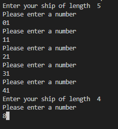
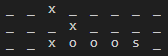

# BATTLESHIPS by magitnup

### Magitnups battleship is a Python terminal game, which runs in the Code Institute mock terminal of Heroku. Users will battle against it out against their own PC and for once maybe actually win to vent some frustrations. 

- You can try it right away! [Magitnups Battleships](https://battleship-game-magitnup-6d82c8e18715.herokuapp.com)

### How to play

---

Battleships in general is a classic and very simple pen and paper game.
This version allows the users to decide where they want to hide their fleet of 6 ships on a 10 times 10 playing field. The Computer will naturally hide its own ships as well.

After hiding the ships, the player will be allowed to shoot first in every round. Which gives the player the advantage in the case of a draw.

Whenever a ship gets hit, it'll will be marked by an "o", the last hit sinking the ship and marking it with "s". In case of a missed shot it will mark the area with "x".

## Features

### Existing features

- Random board generation on the side of the PC
- The user can't see the PC's ships until hit
- User can position the ships themselves

  

- Play against computer
- Accepts user input

- Input validation and error-checking
  - You cannot enter coordinates outside of the grid
  - You cannot use the same coordinates twice
  - You must enter a number
- Notification of sunken ship via "s"

  

  ## Testing

  I have manually tested by doing the following:

  - Passed Code through a PEP8 linter and had no major problems
    Problems: - 22: E302 expected 2 blank lines, found 1 - 122: E302 expected 2 blank lines, found 1 - 152: E722 do not use bare 'except' - 268: E722 do not use bare 'except' - 305: E115 expected an indented block (comment) - 308: E501 line too long (87 > 79 characters) - 317: E501 line too long (87 > 79 characters)
     
  - When trying to fix lines 308 & 317 there was a bug happening that caused the user to play on the same board as the PC, even though two boards where shown.
  - Tried giving invalid input: as intended: Error message
  - Tested the application locally and over the Code Institute Heroku terminal

### Bugs

    Mostly resolved (like mentioned the bug with the same board)

### Validator testing

    * the above mentioned returns

## Deployment

    * Fork or clone this repository
    * Create a new Heroku app
    * Set the buildbacks to Python and NodeJS in this order
    * Link Heroku app to repository
    * Click on deploy

## Credits

    * Code Institute deployment terminal
    * [Knowledge Mavens](https://www.youtube.com/watch?v=tF1WRCrd_HQ) for inspiration, no code taken directly
    * My Brother for extensive help, especially with tactics of the PC solving the battleship board
